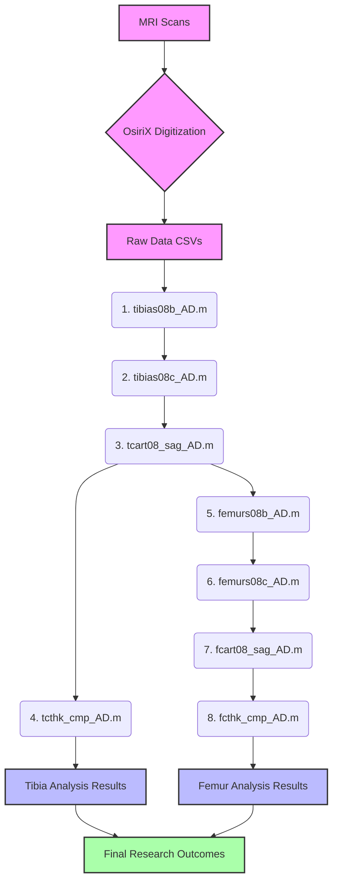

# UVM_MRI_Reliability

## UVM MRI Reliability Study: Cartilage Thickness Processing and Comparison

This repository contains a suite of MATLAB scripts designed to process, analyze, and compare subchondral bone and cartilage data from MRI scans, specifically focusing on the tibia and femur. The scripts establish anatomical coordinate systems, transform digitized points, calculate cartilage thicknesses, and perform comparisons across different MRI scan types (T1FFE, T1rho, and T2S).

The workflow is sequential, with each script building upon the outputs of the preceding ones.

---

## Workflow and Order of M-Files

The scripts in this repository must be executed in the following order to ensure proper data flow and dependencies are met:

1. `tibias08b_AD.m`  
2. `tibias08c_AD.m`  
3. `tcart08_sag_AD.m`  
4. `tcthk_cmp_AD.m`  
5. `femurs08b_AD.m`  
6. `femurs08c_AD.m`  
7. `fcart08_sag_AD.m`  
8. `fcthk_cmp_AD.m`  

### Workflow Flowchart

---

## Script Descriptions

### 1. `tibias08b_AD.m`
- **Purpose**: Processes digitized tibia bone data to establish the tibial coordinate system.
- **Outputs**: PDF plots, `***_tibiaCS.mat`, updates `sd` in `All Subjects Tibia Bone Data.mat`.

### 2. `tibias08c_AD.m`
- **Purpose**: Transforms tibia cartilage data using the tibial coordinate system.
- **Dependencies**: `***_tibiaCS.mat` from `tibias08b_AD.m`.
- **Outputs**: PDF plots, `***_tibiaCart.mat`, updates `sd` in `All Subjects Tibia Bone And Cartilage Data.mat`.

### 3. `tcart08_sag_AD.m`
- **Purpose**: Calculates tibial cartilage thicknesses using a grid.
- **Dependencies**: `***_tibiaCS.mat` and `***_tibiaCart.mat`.
- **Outputs**: PDF plots, `***_tcart08_thk.mat`, `scanType_tgrid08_.mat`, updates `sd`.

### 4. `tcthk_cmp_AD.m`
- **Purpose**: Compares tibial thickness across scan types.
- **Dependencies**: Thickness and grid data.
- **Outputs**: Tibial comparison plots, Excel files.

### 5. `femurs08b_AD.m`
- **Purpose**: Processes femur bone data and coordinate system.
- **Dependencies**: Uses `sd` from `tcart08_sag_AD.m`.
- **Outputs**: PDF plots, `***_femurCS.mat`, updates `sd`.

### 6. `femurs08c_AD.m`
- **Purpose**: Transforms femur cartilage data.
- **Dependencies**: `***_femurCS.mat`.
- **Outputs**: PDF plots, `***_femurCart.mat`, updates `sd`.

### 7. `fcart08_sag_AD.m`
- **Purpose**: Calculates femoral cartilage thickness.
- **Dependencies**: `***_femurCS.mat`, `***_femurCart.mat`.
- **Outputs**: PDF plots, `***_fcart08_thk.mat`, `scanType_fgrid08_.mat`, updates `sd`.

### 8. `fcthk_cmp_AD.m`
- **Purpose**: Compares femoral thickness across scan types.
- **Dependencies**: Thickness and grid data.
- **Outputs**: Femoral comparison plots, Excel files.

---

## Common Dependencies

These custom MATLAB M-files are required:

- `fix_pts_AD.m`
- `tibia_cs8.m`
- `f_cs_14.m`
- `rd_roi6.m`
- `mk_tri6.m`
- `mk_tri4f.m`
- `tri_fix2.m`
- `car_thk8.m`
- `gridproj.m`
- `comb_dat.m`
- `nod2tri.m`
- `quadconn.m`
- `freg_axpf2_AD.m`

---

## Data Structure (`sd`)

The `sd` structure stores data paths and is updated across scripts:

- `All Subjects Tibia Bone Data.mat`
- `All Subjects Tibia Bone And Cartilage Data.mat`
- `All Subjects Tibia Cartilage Thickness Data.mat`
- `All Subjects Full Tibia and Femur Bone Data.mat`
- `All Subjects Full Tibia and Femur Bone and Cartilage Data.mat`
- `All Subjects Tibia and Femur Cartilage Thickness Data.mat`

---

## Usage

1. Organize raw CSV digitization files in the `Data` directory.
2. Ensure all helper M-files are in the MATLAB path.
3. Run scripts in order (see above).
4. Each script prompts for the base data directory.

---

## Authors

- Mack Gardner-Morse  
- Aaron Dees

---

**Last Edited**: July 7, 2025