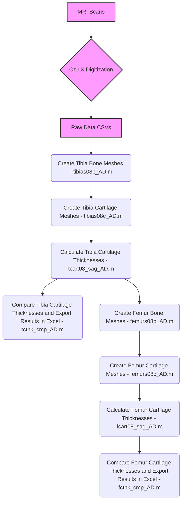

# UVM_MRI_Reliability

## UVM MRI Reliability Study: Cartilage Thickness Processing and Comparison

This repository contains a suite of MATLAB scripts designed to process, analyze, and compare subchondral bone and cartilage data from MRI scans, specifically focusing on the tibia and femur. The scripts establish anatomical coordinate systems, transform digitized points, calculate cartilage thicknesses, and perform comparisons across different MRI scan types (T1FFE, T1rho, and T2S).

The workflow is sequential, with each script building upon the outputs of the preceding ones.

---

## Workflow and Order of M-Files

The scripts in this repository must be executed in the following order to ensure proper data flow and dependencies are met:

```
tibias08b_AD.m
tibias08c_AD.m
tcart08_sag_AD.m
tcthk_cmp_AD.m
femurs08b_AD.m
femurs08c_AD.m
fcart08_sag_AD.m
fcthk_cmp_AD.m
```

### Workflow Flowchart



The flowchart visually represents the entire data processing pipeline, highlighting the sequential nature of the MATLAB scripts and their key inputs and outputs.

---

## Script Descriptions

### 1. `tibias08b_AD.m`
**Purpose**: Processes digitized tibia bone data to establish the tibial coordinate system.

**Functionality**: Reads raw bone digitization points and transforms the data into the tibia's anatomical coordinate system. It plots the coordinate system and the transformed bone data.

**Outputs**:
- PDF Plots: `***_tibias08b.pdf`
- MAT File: `***_tibiaCS.mat`
- sd Structure: Updates `All Subjects Tibia Bone Data.mat`

### 2. `tibias08c_AD.m`
**Purpose**: Processes digitized tibia cartilage data and transforms it into the previously established tibial bony coordinate system.

**Dependencies**: `***_tibiaCS.mat`

**Outputs**:
- PDF Plots: `***_tibias08c.pdf`
- MAT File: `***_tibiaCart.mat`
- sd Structure: Updates `All Subjects Tibia Bone And Cartilage Data.mat`

### 3. `tcart08_sag_AD.m`
**Purpose**: Calculates tibial cartilage thicknesses using a standardized grid.

**Dependencies**: `***_tibiaCS.mat`, `***_tibiaCart.mat`

**Outputs**:
- PDF Plots: `***_tcart08_sagittal_thk.pdf`
- MAT Files:
  - Grid scaling data: `scanType_tgrid08_.mat`
  - Thicknesses: `***_tcart08_thk.mat`
- sd Structure: Updates `All Subjects Tibia Cartilage Thickness Data.mat`

### 4. `tcthk_cmp_AD.m`
**Purpose**: Compares tibial cartilage thicknesses across different MRI scan types.

**Dependencies**: `***_tcart08_thk.mat`, `scanType_tgrid08_.mat`

**Outputs**:
- PDF Plots: `Tibial Thickness Differences.pdf`
- Excel Files: `tib_lat_pos.xlsx`, `tib_med_pos.xlsx`, etc.

### 5. `femurs08b_AD.m`
**Purpose**: Processes digitized femur bone data to establish the femoral coordinate system.

**Dependencies**: `sd` from `All Subjects Tibia Cartilage Thickness Data.mat`

**Outputs**:
- PDF Plots: `***_femur08b.pdf`
- MAT File: `***_femurCS.mat`
- sd Structure: Updates `All Subjects Full Tibia and Femur Bone Data.mat`

### 6. `femurs08c_AD.m`
**Purpose**: Processes digitized femur cartilage data and transforms it into the femoral bony coordinate system.

**Dependencies**: `***_femurCS.mat`

**Outputs**:
- PDF Plots: `***_femurs08c.pdf`
- MAT File: `***_femurCart.mat`
- sd Structure: Updates `All Subjects Full Tibia and Femur Bone and Cartilage Data.mat`

### 7. `fcart08_sag_AD.m`
**Purpose**: Calculates femoral cartilage thicknesses using a standardized grid.

**Dependencies**: `***_femurCS.mat`, `***_femurCart.mat`

**Outputs**:
- PDF Plots: `***_fcart08_sagittal_thk.pdf`
- MAT Files:
  - Grid scaling data: `scanType_fgrid08_.mat`
  - Thicknesses: `***_fcart08_thk.mat`
- sd Structure: Updates `All Subjects Tibia and Femur Cartilage Thickness Data.mat`

### 8. `fcthk_cmp_AD.m`
**Purpose**: Compares femoral cartilage thicknesses across different MRI scan types.

**Dependencies**: `***_fcart08_thk.mat`, `scanType_fgrid08_.mat`

**Outputs**:
- PDF Plots: `Femoral Thickness Differences.pdf`
- Excel Files: `fem_lat_pos.xlsx`, `fem_med_pos.xlsx`, etc.

---

## Common Dependencies

Several custom MATLAB M-files are required in the current directory or MATLAB path for these scripts to run correctly. These include (but are not limited to):

```
fix_pts_AD.m
tibia_cs8.m
f_cs_14.m
rd_roi6.m
mk_tri6.m
mk_tri4f.m
tri_fix2.m
car_thk8.m
gridproj.m
comb_dat.m
nod2tri.m
quadconn.m
freg_axpf2_AD.m
```

---

## Data Structure (`sd`)

The `sd` (subject data) structure is a critical component of this workflow. It is initialized in the first script and progressively updated by subsequent scripts to store paths to raw data, processed bone and cartilage files, and grid information for each subject and scan type.

These .mat files include:
- `All Subjects Tibia Bone Data.mat`
- `All Subjects Tibia Bone And Cartilage Data.mat`
- `All Subjects Tibia Cartilage Thickness Data.mat`
- `All Subjects Full Tibia and Femur Bone Data.mat`
- `All Subjects Full Tibia and Femur Bone and Cartilage Data.mat`
- `All Subjects Tibia and Femur Cartilage Thickness Data.mat`

---

## Usage

To use these scripts:

1. Organize your raw data: Ensure all necessary raw data files (e.g., CSV digitizations) are placed within a directory named `Data` in the root of this repository.
2. Ensure all necessary custom M-files are in your MATLAB path.
3. Run the scripts sequentially as listed in the "Workflow and Order of M-Files" section.
4. Each script will prompt you to select the base data directory (which should be the root of this repository, containing the Data folder).

---

## Authors

- Mack Gardner-Morse
- Aaron Dees

**Last Edited**: July 7, 2025